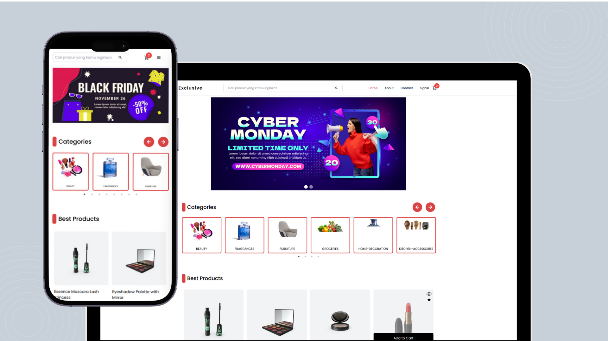
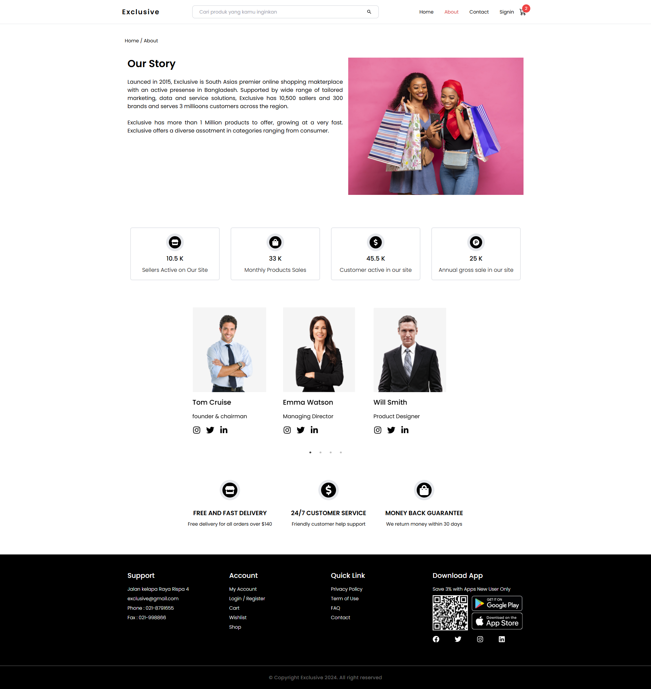
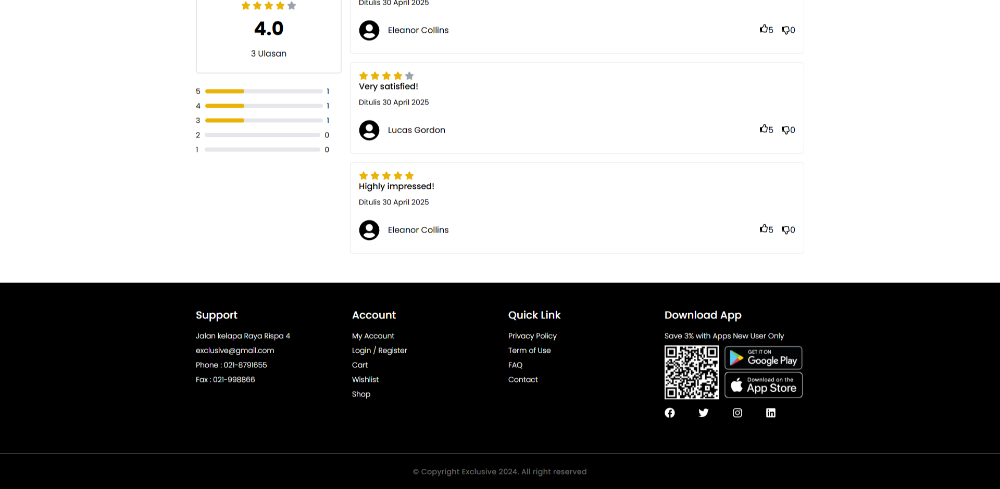
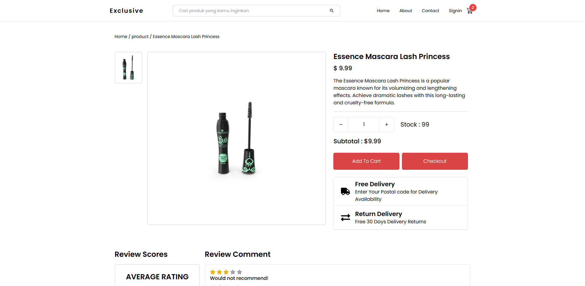
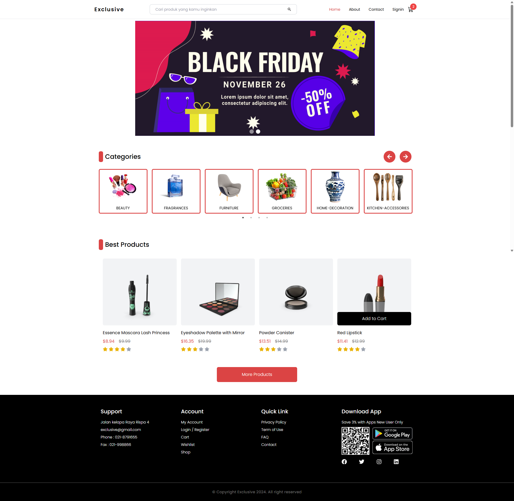

# 🛒 Exclusivemart – Static E-commerce Frontend (React + TailwindCSS)

**Exclusivemart** is a modern, responsive e-commerce frontend web app built using **React.js**, **TailwindCSS**, and **Redux Toolkit**. It demonstrates typical online store features like product listing, search, filtering, and user authentication—all powered by a dummy API. The app is ideal for portfolio presentation or as a base project for e-commerce MVPs.

---

## 1. Project Overview

This project simulates a typical online store experience for end-users. It provides core e-commerce functionality including dynamic product listing, search, cart, checkout flow, and restricted user profile routes. The app communicates with a mock API to fetch product data and user sessions.

---

## 2. Project Goals

- Build a fully responsive e-commerce interface using React and TailwindCSS.
- Fetch and display product data from a dummy API (dummyjson.com).
- Enable user login simulation and session-based restricted access.
- Provide essential UX flows: search, filtering, pagination, cart management, and checkout summary.

---

## 3. Challenges

- Managing nested route access for authentication-protected pages.
- Organizing Redux logic for products, users, cart, and checkout.
- Implementing dynamic filtering, sorting, and pagination efficiently.
- Ensuring lazy-loading and suspense fallback for optimal performance.

---

## 4. Approach & Solution

The app is structured using React + React Router DOM for routing, Redux Toolkit for state management, and Axios for external API communication. Lazy-loaded pages reduce bundle size and improve performance. Restricted pages are wrapped in authentication middleware using cookie checks. Product data, including categories and details, are dynamically fetched from dummyjson API.

---

## 5. Key Features

- 🛍️ **Product Catalog** – Displays real-time products with categories, price, ratings, and images.
- 🔍 **Search & Filter** – Supports keyword-based search, category filtering, and sorting.
- 🛒 **Shopping Cart** – Add/remove products, quantity management, and cart summary.
- 🔐 **Auth-Protected Routes** – User profile and checkout require simulated login.
- 📦 **Checkout Summary** – Displays selected products, total price, and shipping details.
- 🍪 **Cookie-Based Auth Simulation** – Implements fake login with cookie-based protection.
- 🔁 **Pagination** – Handles product pages efficiently for large datasets.
- ♻️ **Reusable Components** – Header, Footer, ProductCard, FilterMenu, etc.
- ⚡ **Lazy Load Pages** – Optimizes initial load with `React.lazy` and `Suspense`.
- 📱 **Responsive Design** – Fully adaptive for mobile, tablet, and desktop views.

---

## 6. Tech Stack

- React.js
- TailwindCSS
- Redux Toolkit
- React Router DOM
- Axios
- React Toastify
- Framer Motion
- React Slick / Swiper

---

## 7. Getting Started

1. **Clone the repository**

```bash
git clone https://github.com/fiqrioemry/Frontend_eccomerce_web_app.git
cd Frontend_eccomerce_web_app
```

2. **Install dependencies**

```bash
npm install
```

3. **Run locally**

```bash
npm start
```

---

## 🌐 Live Demo

🔗 [https://exclusivemart.netlify.app](https://exclusivemart.netlify.app)

---

## 👨‍💼 Author

- Website: [https://ahmadfiqrioemry.com](https://ahmadfiqrioemry.com)
- LinkedIn: [linkedin.com/in/ahmadfiqrioemry](https://linkedin.com/in/ahmadfiqrioemry)
- Instagram: [@oemryfiqri](https://instagram.com/oemryfiqri)
- Medium: [@foemry](https://medium.com/@foemry)

---

## 📂 Folder Structure Highlights

```
src/
├── components/       # Reusable UI components (Header, Footer, ProductCard)
├── pages/            # Page views (Home, About, Contact, ProductDetail, etc.)
├── middleware/       # Auth wrapper (UserAuth, NonUserAuth)
├── reducer/          # Redux slices and logic
├── features/         # ScrollToTop, PageLoading, etc.
├── App.jsx           # Root component and route logic
└── main.jsx          # App entry point
```

---

## 📄 License

This project is licensed under the MIT License – feel free to use and modify.

## 📸 Preview Screenshots






